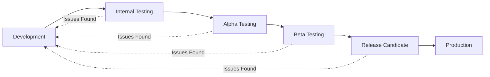

# Lost & Tossed Deployment Guide

## Overview
The Lost & Tossed app uses GitHub Actions for automated builds and deployments to Google Play Store. The deployment workflow supports multiple release tracks with automatic version management.

## Release Tracks

The workflow automatically determines the deployment track based on the release tag format:

| Tag Format | Track | Description |
|------------|-------|-------------|
| `v1.0.0` | Production | Full public release |
| `v1.0.0-beta.1` | Beta | Closed testing for beta users |
| `v1.0.0-alpha.1` | Alpha | Early access for alpha testers |
| `v1.0.0-rc.1` | Beta | Release candidate (deploys to beta) |
| Any other format | Internal | Internal testing track |

## Creating a Release

### 1. Internal Testing
```bash
# Create and push a tag for internal testing
git tag v0.1.0-internal.1
git push origin v0.1.0-internal.1

# Create a GitHub release
gh release create v0.1.0-internal.1 --title "Internal Release v0.1.0" --notes "Internal testing build"
```

### 2. Alpha Release
```bash
# Create an alpha release
git tag v0.1.0-alpha.1
git push origin v0.1.0-alpha.1

gh release create v0.1.0-alpha.1 --title "Alpha Release v0.1.0" --notes "Alpha testing build with new features"
```

### 3. Beta Release
```bash
# Create a beta release
git tag v0.1.0-beta.1
git push origin v0.1.0-beta.1

gh release create v0.1.0-beta.1 --title "Beta Release v0.1.0" --notes "Beta testing build"
```

### 4. Production Release
```bash
# Create a production release (no suffix)
git tag v1.0.0
git push origin v1.0.0

gh release create v1.0.0 --title "Release v1.0.0" --notes "First production release of Lost & Tossed!"
```

## Manual Deployment

You can also trigger deployments manually from the GitHub Actions tab:

1. Go to Actions → "Build and Deploy to Play Store"
2. Click "Run workflow"
3. Select the branch and deployment track
4. Click "Run workflow"

## Version Management

The workflow uses a timestamp-based version code system:
- Format: `YYMMDDHHMM` where YY is years since 2025
- This ensures version codes are always increasing
- Version names are extracted from git tags (e.g., `v1.2.3` becomes `1.2.3`)

## Required Secrets

Configure these secrets in your GitHub repository settings:

| Secret Name | Description |
|-------------|-------------|
| `RELEASE_KEYSTORE_BASE64` | Base64 encoded keystore file |
| `KEYSTORE_PASSWORD` | Password for the keystore |
| `KEY_PASSWORD` | Password for the signing key |
| `KEY_ALIAS` | Alias of the signing key |
| `GOOGLE_PLAY_SERVICE_ACCOUNT_JSON` | Service account JSON for Play Store API |

### Setting up Secrets

1. **Generate a keystore** (if not already done):
```bash
keytool -genkey -v -keystore lost-and-tossed-upload-key.p12 \
  -storetype PKCS12 -keyalg RSA -keysize 2048 -validity 10000 \
  -alias upload
```

2. **Encode keystore as Base64**:
```bash
base64 -w 0 lost-and-tossed-upload-key.p12 > keystore.base64
# Copy the contents of keystore.base64 to the RELEASE_KEYSTORE_BASE64 secret
```

3. **Create a Google Play service account**:
   - Go to Google Play Console → Setup → API access
   - Create a new service account
   - Grant "Release manager" permissions
   - Download the JSON key file

4. **Add secrets to GitHub**:
   - Go to Settings → Secrets and variables → Actions
   - Add each secret with its corresponding value

## Release Notes

Update release notes in `distribution/whatsnew/whatsnew-en-US` before creating a release. These notes will be displayed on the Google Play Store listing.

## Testing the Workflow

1. **Test locally** (requires act):
```bash
act -j test
```

2. **Test deployment** (internal track):
```bash
# Create a test tag
git tag v0.0.1-test.1
git push origin v0.0.1-test.1
```

## Monitoring Deployments

1. Check GitHub Actions for build status
2. Monitor Google Play Console for processing status
3. Test the deployed app on the appropriate track

## Rollback Procedure

If issues are found after deployment:

1. **For non-production tracks**: Deploy a new fixed version
2. **For production**: 
   - Use Play Console to halt rollout
   - Deploy a hotfix version (e.g., `v1.0.1`)
   - Consider using staged rollout for future releases

## Best Practices

1. **Always test on internal/alpha first** before promoting to beta or production
2. **Use semantic versioning** for clear version progression
3. **Document breaking changes** in release notes
4. **Monitor crash reports** after each deployment
5. **Keep release notes user-friendly** - focus on features, not technical details

## Troubleshooting

### Build Failures
- Check Flutter version compatibility
- Verify all tests pass locally
- Ensure dependencies are up to date

### Deployment Failures
- Verify all secrets are correctly configured
- Check Google Play Console for any policy violations
- Ensure version codes are incrementing

### Version Code Conflicts
- The timestamp-based system should prevent conflicts
- If needed, manually increment the version code

## Support

For deployment issues, check:
1. GitHub Actions logs for build errors
2. Google Play Console for upload errors
3. Project documentation for app-specific issues

## Example Release Flow



Each stage should include:
- Thorough testing
- User feedback collection
- Performance monitoring
- Crash report analysis

## Micro-copy for Release Notes

Keep release notes in the Lost & Tossed spirit:

**Good examples:**
- "A glove begins its solo adventure - now with better photo capture!"
- "The snack wrapper that tells a story - improved category detection"
- "Messages meant to be seen - enhanced poster documentation"

**Avoid:**
- Technical jargon
- Bug fix lists without context
- Generic update messages
